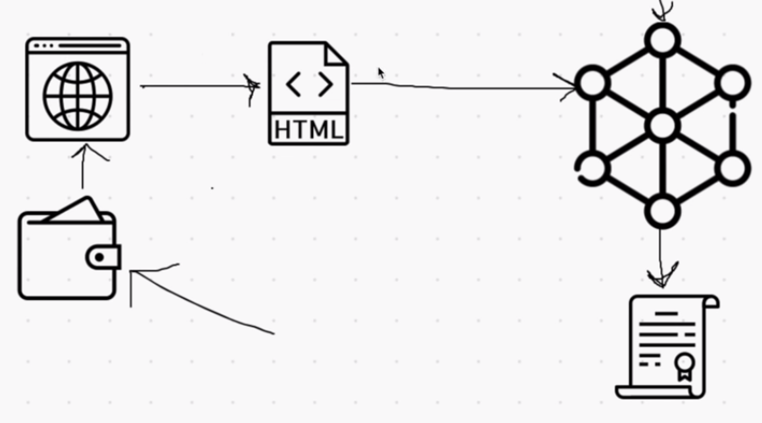

# DBank-Project

Task: Create a Banking Dapp which has a beautiful front-end design.

## Overview :



*Backend:*
----------
- Blockchain 
- Smart Contract
- Token
- Bank

*Frontend:*
-----------
- React.js
- web3.js 

## Depedencies :

- Solidity = Used to create Smart Contract
- Truffle 
- Node.js 
- Web3.js = To connect webapp with local Blockchain
- Ganache = Local Blockchain Network
- MetaMask = Wallet
- Bootstrap
- React.js = For Frontend 

## Step 1: Create Smart Contracts:

Create two smart contract **dbank and token**. Bank smart contract uses token generated by token smart contract.

1. Token Smart Contract: 

2. Smart Contract of DBank:
   - Bank smart contracts have following functions: 
     
    ```java
    function deposit() payable public {}
    function withdraw() payable public {}
    function borrow() payable public {}
    function payOff() payable public {}

    ```

## Step 2: 

## Step 3 :
