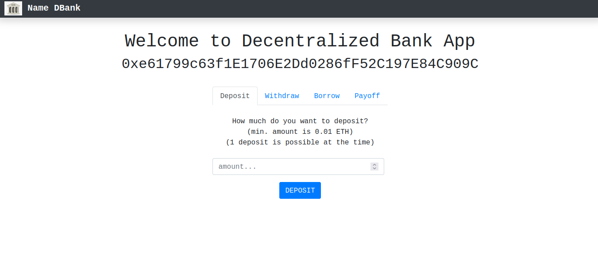
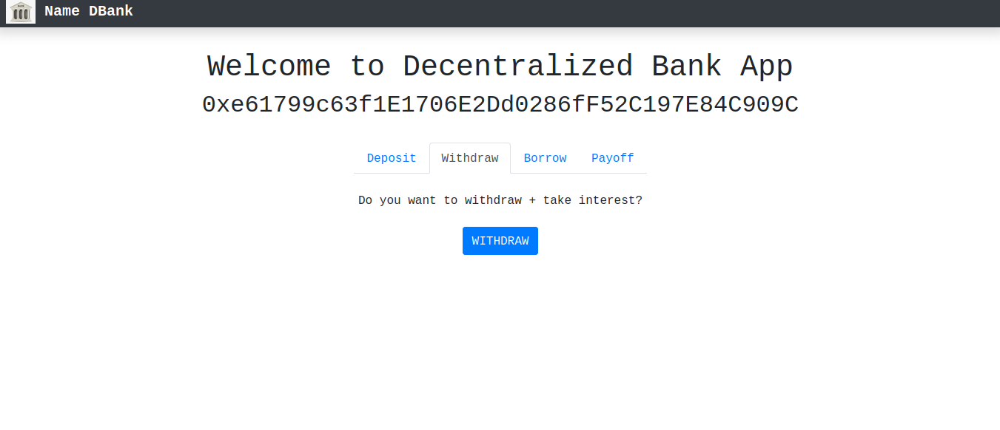
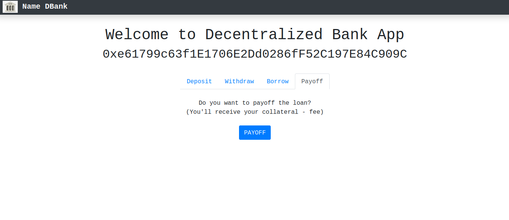
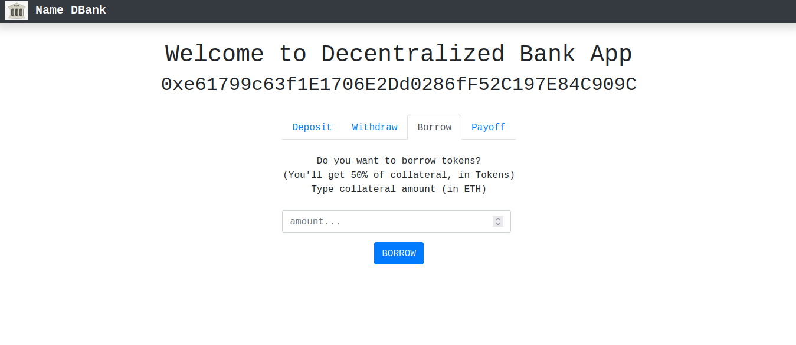

# DBank-Project

Task: Create a Banking Dapp which has a beautiful front-end design.

## Overview :


*Backend:*
----------
- Blockchain 
- Smart Contract
- Token
- Bank

*Frontend:*
-----------
- React.js
- web3.js 

## Depedencies :

- Solidity = Used to create Smart Contract
- Truffle 
- Node.js 
- Web3.js = To connect webapp with local Blockchain
- Ganache = Local Blockchain Network
- MetaMask = Wallet
- Bootstrap
- React.js = For Frontend 

## Step 1: Create Smart Contracts:

Create two smart contract **dbank and token**. Bank smart contract uses token generated by token smart contract.

1. Token Smart Contract: 
   ```js
    function passMinterRole(address dBank) public returns(bool) {} 
    function mint(address account, uint256 amount) public {}
   ```

2. Smart Contract of DBank:
   - Bank smart contracts have following functions: 
     
    ```js
    function deposit() payable public {}
    function withdraw() payable public {}
    function borrow() payable public {}
    function payOff() payable public {}

    ```

## Step 2: Using Web3.js 
 - Using Web3.js to connect webapp to local Blockchain network which is **Ganache**. 
 - deploy.js : 
```js
 //deploy Token
  await deployer.deploy(Token);
  //assign token into variable to get it's address
  const token = await Token.deployed();
  //pass token address for dBank contract(for future minting)
  await deployer.deploy(dBank, token.address);
  //assign dBank contract into variable to get it's address
  const dbank = await dBank.deployed();
  //change token's owner/minter from deployer to dBank
  await token.passMinterRole(dbank.address);
   
```

## Step 3: Using React for front-end :  

- Connect MetaMask with Webapp:
```js
 async loadBlockchainData(dispatch) {
    if (typeof window.ethereum !== "undefined") {
         const web3 = new Web3(window.ethereum);
         const netId = await web3.eth.net.getId();
         const accounts = await web3.eth.getAccounts();

         //load balance
         if (typeof accounts[0] !== "undefined") {
           const balance = await web3.eth.getBalance(accounts[0]);
           this.setState({ account: accounts[0], balance: balance, web3: web3 });
         } else {
           window.alert("Please login with MetaMask");
         }
      else {
      window.alert("Please install MetaMask");
    }
  }

```
- Add front-end for withdraw,deposit, payoff, borrow 
```html
 <div className="content mr-auto ml-auto">
    <Tabs defaultActiveKey="profile" id="uncontrolled-tab-example">
      <Tab eventKey="deposit" title="Deposit">
        <div>
          <br></br>
          How much do you want to deposit?
          <br></br>
          (min. amount is 0.01 ETH)
          <br></br>
          (1 deposit is possible at the time)
          <br></br>
          <form
            onSubmit={(e) => {
              e.preventDefault();
              let amount = this.depositAmount.value;
              amount = amount * 10 ** 18; //convert to wei
              this.deposit(amount);
            }}
          >
            <div className="form-group mr-sm-2">
              <br></br>
              <input
                id="depositAmount"
                step="0.01"
                type="number"
                ref={(input) => {
                  this.depositAmount = input;
                }}
                className="form-control form-control-md"
                placeholder="amount..."
                required
              />
            </div>
            <button type="submit" className="btn btn-primary">
              DEPOSIT
            </button>
          </form>
        </div>
      </Tab>
      <Tab eventKey="withdraw" title="Withdraw">
        <br></br>
        Do you want to withdraw + take interest?
        <br></br>
        <br></br>
        <div>
          <button
            type="submit"
            className="btn btn-primary"
            onClick={(e) => this.withdraw(e)}
          >
            WITHDRAW
          </button>
        </div>
      </Tab>
      <Tab eventKey="borrow" title="Borrow">
        <div>
          <br></br>
          Do you want to borrow tokens?
          <br></br>
          (You'll get 50% of collateral, in Tokens)
          <br></br>
          Type collateral amount (in ETH)
          <br></br>
          <br></br>
          <form
            onSubmit={(e) => {
              e.preventDefault();
              let amount = this.borrowAmount.value;
              amount = amount * 10 ** 18; //convert to wei
              this.borrow(amount);
            }}
          >
            <div className="form-group mr-sm-2">
              <input
                id="borrowAmount"
                step="0.01"
                type="number"
                ref={(input) => {
                  this.borrowAmount = input;
                }}
                className="form-control form-control-md"
                placeholder="amount..."
                required
              />
            </div>
            <button type="submit" className="btn btn-primary">
              BORROW
            </button>
          </form>
        </div>
      </Tab>
      <Tab eventKey="payOff" title="Payoff">
        <div>
          <br></br>
          Do you want to payoff the loan?
          <br></br>
          (You'll receive your collateral - fee)
          <br></br>
          <br></br>
          <button
            type="submit"
            className="btn btn-primary"
            onClick={(e) => this.payOff(e)}
          >
            PAYOFF
          </button>
        </div>
      </Tab>
    </Tabs>
  </div>

```

## Output: 

- Deposit:



- Withdraw:



- Payoff:



- Borrow:




